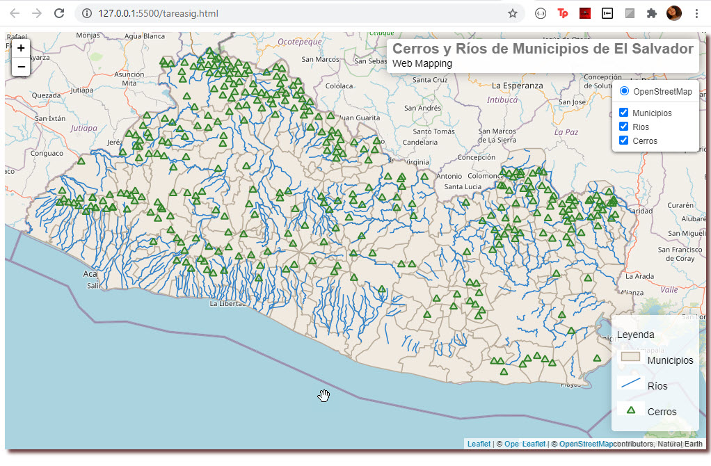

# WebMappingMunicipiosRiosCerrosES

CERROS Y RÍOS EN MUNICIPIOS DE EL SALVADOR

Integrantes:
Danniela Alejandra Renderos Laínez | 
Jeniffer Daniela Merino Beltrán |
César Alejandro Rosales Cruz |
Cristian Alexander Mundo Orellana |
Rudi David Vallecios Gonzales 

    
      
    
     
    
      <!-- ALL-CONTRIBUTORS-BADGE:START - Do not remove or modify this section -->
      
      
      
      
    <!-- ALL-CONTRIBUTORS-BADGE:END -->
    

## Generalidades ⚙️
### Herramientas y licencias 🛠
 
   #### [Leaflet](https://leafletjs.com/) 🗺
  Es una librería JavaScript open source ampliamente utilizada para la publicación de mapas en la web. Lanzado por primera vez en 2011, es compatible con la mayoría de las     plataformas móviles y de escritorio y admite HTML5 y CSS3.  
 Licencia: <strong>BSD-2-Clause</strong>
  
  #### [Node.js](https://www.kaggle.com/) 🦆
   Node.js es un entorno en tiempo de ejecución multiplataforma, de código abierto, para la capa del servidor (pero no limitándose a ello) basado en el lenguaje de programación JavaScript, asíncrono, con E/S de datos en una arquitectura orientada a eventos y basado en el motor V8 de Google.  
   Licencia: <strong>MIT</strong>
   
 #### [Flask](https://flask.palletsprojects.com) 🐍
   Es un framework minimalista escrito en Python que permite crear aplicaciones web rápidamente y con un mínimo número de líneas de código. Está basado en la especificación WSGI de Werkzeug y el motor de templates Jinja2. 
   licencia: <strong>BSD</strong> 
   
 
    

## Contribuidores 🌍

<!-- ALL-CONTRIBUTORS-LIST:START - Do not remove or modify this section -->
<!-- prettier-ignore-start -->
<!-- markdownlint-disable -->
<table align="center">
  <tr>
    <td align="center"><a href="https://github.com/henrybanchon3"> <b> Jeniffer Merino </b></a> <a href="#design-henrybanchon3" title="Design">🎨</a> <a href="https://github.com/BigDreamsCoders/Tremor/pulls?q=is%3Apr+reviewed-by%3Ahenrybanchon3" title="Reviewed Pull Requests">👀</a></td>
    <td align="center"><a href="http://vsco.co/nelsoncaastro"> <b>Cristian Mundo</b></a> <a href="https://github.com/BigDreamsCoders/Tremor/commits?author=nelsoncaastro" title="Documentation">📖</a> <a href="#design-nelsoncaastro" title="Design">🎨</a> <a href="https://github.com/BigDreamsCoders/Tremor/pulls?q=is%3Apr+reviewed-by%3Anelsoncaastro" title="Reviewed Pull Requests">👀</a></td>
    <td align="center"><a href="https://github.com/00099216"> <b> Danniela Renderos</b></a> <a href="https://github.com/BigDreamsCoders/Tremor/commits?author=00099216" title="Documentation">📖</a> <a href="https://github.com/BigDreamsCoders/Tremor/pulls?q=is%3Apr+reviewed-by%3A00099216" title="Reviewed Pull Requests">👀</a></td>
    <td align="center"><a href="https://github.com/TheAlexBig"> <b> César Rosales </b></a> <a href="https://github.com/BigDreamsCoders/Tremor/commits?author=TheAlexBig" title="Code">💻</a></td>
    <td align="center"><a href="http://pedrogas.me"> <b>Rudi Gonzále</b></a> <a href="https://github.com/BigDreamsCoders/Tremor/commits?author=petrlr14" title="Code">💻</a> <a href="#infra-petrlr14" title="Infrastructure (Hosting, Build-Tools, etc)">🚇</a> <a href="https://github.com/BigDreamsCoders/Tremor/pulls?q=is%3Apr+reviewed-by%3Apetrlr14" title="Reviewed Pull Requests">👀</a></td>
  </tr>
</table>

<!-- markdownlint-enable -->
<!-- prettier-ignore-end -->
<!-- ALL-CONTRIBUTORS-LIST:END -->

Este proyecto sigue las especificaciones de [all-contributors](https://github.com/all-contributors/all-contributors). Cualquier tipo de contribuciones son bienvenidas!
